# Fast Fingers

## My Portfolio 2 Project

### By Bradley Hammond

### [View Live Project Here](https://brad-hammond.github.io/Fast-Fingers/)

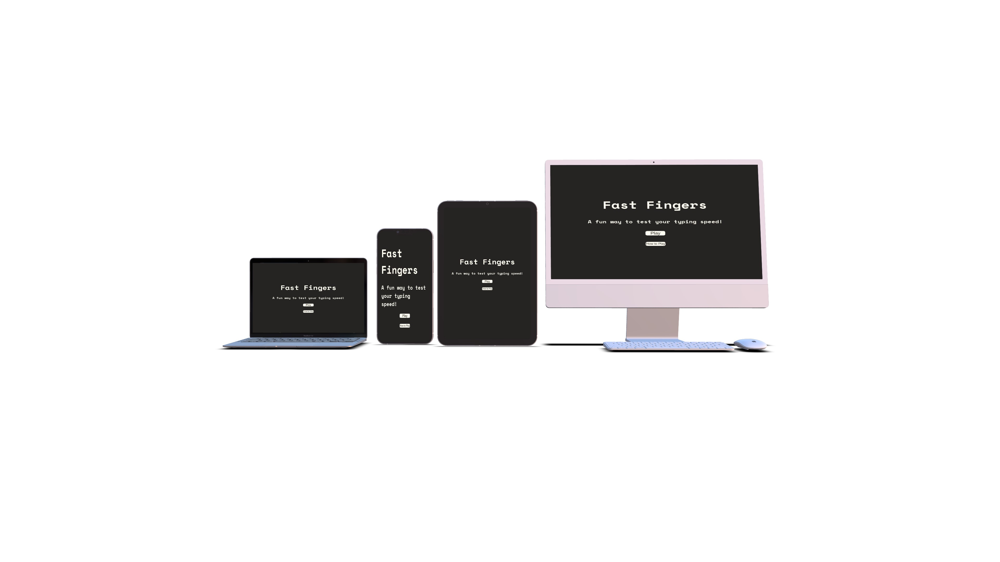

### About Fast Fingers

Fast Fingers is an online typing speed tester designed to help users assess and improve their typing speed and accuracy. Whether you're a seasoned typist looking to refine your skills or a beginner aiming to boost your productivity, Fast Fingers provides an intuitive platform for honing your typing abilities.

## Project Goals and User Stories

### Project Goals

- The goal of this website is to create a fun and effective way for users to test their typing speed.

- It has been designed for people who want to keep coming back to improve their score and compete to get the highest score.

### User Stories

#### First Time User

| Story No. | Story                                                                                                                                                                                                  |
| --------- | ------------------------------------------------------------------------------------------------------------------------------------------------------------------------------------------------------ |
| 1         | As a first time user , <br> I want to be able to know how to play the game <br> so that I can enjoy the game. <br><br>I know I am done when there are clear instructions shown to the user.            |
| 2         | As a first time user, <br> I want to be able to see my CPM and WPM <br> so I can see how fast I am typing <br><br>I know i am done when I can see my CPM and WPM scores.                               |
| 3         | As a first time user, <br> I want to be able to see how long I have been typing for <br> so that I can see if my time is good or bad <br><br>I know I am done when I can see the timer for my session. |

#### Returning Users

| Story No. | Story                                                                                                                                                                                                       |
| --------- | ----------------------------------------------------------------------------------------------------------------------------------------------------------------------------------------------------------- |
| 1         | As a returning user, <br> I want to refine my typing skills <br> so that I can improve my scores. <br><br>I know I am done when my typing speed has increased.                                              |
| 2         | As a returning user , <br> I want to have new and different sentences to type <br> so that I can keep being challenged.<br><br>I know I am done when their are new sentences and paragraphs for me to type. |

#### All Users

| Story No. | Story                                                                                                                                                                                                               |
| --------- | ------------------------------------------------------------------------------------------------------------------------------------------------------------------------------------------------------------------- |
| 1         | As a user , <br> I want to be able to try again if I made a mistake<br> so that I can restart and try to improve. <br><br>I know I am done when I have restarted the game.                                          |
| 2         | As a user , <br> I want to be able to view my scores after completing the quote<br> so that I can see if I have improved. <br><br>I know I am done when the scores are shown after completion.                      |
| 3         | As a user , <br> I want to be able to see if I have made any mistakes while typing<br> so that I can go back and correct if need be.<br><br>I know I am done when I can see if the quotes letters are red or green. |

## Design

### Wireframes

The below images are mock up wireframes that I made before starting this project, they helped me in designing my webpage and stayed relatively true to design.

### Desktop

#### Homepage / Landing Page

The below is my mockup wireframe of the home/landing page on desktop, this stayed true to design and was very helpful when styling and designing this webpage.

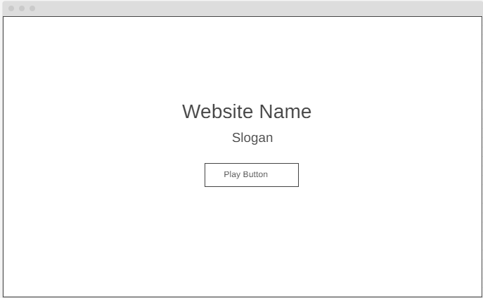

#### Typing Test Page

The below is my mockup wireframe of the typing test page for desktop, this stayed close to design.<br>However in the end I opted for the count down timer to be at the top of the screen as this was better user experience due to it being easier for the user to see when playing.

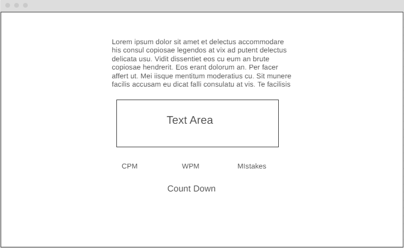

### Mobile

#### Homepage / Landing Page

The below is my mockup wireframe of the home/landing page on mobile, this stayed true to design and was very helpful when styling and designing this webpage.

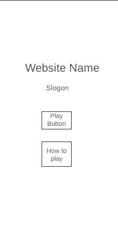

#### Typing Test Page

The below is my mockup wireframe of the typying test page for mobile, this also stayed similar to the final product.<br>However, similar to the desktop, the count down timer was moved to the top for better user experience.

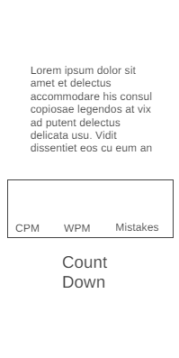

## Features

### Index / Landing Page

#### Play / How to play Button

The play button lets the user begin by clicking play!
The how to play button is a modal which once clicked, displays the instructions on how to play the game.

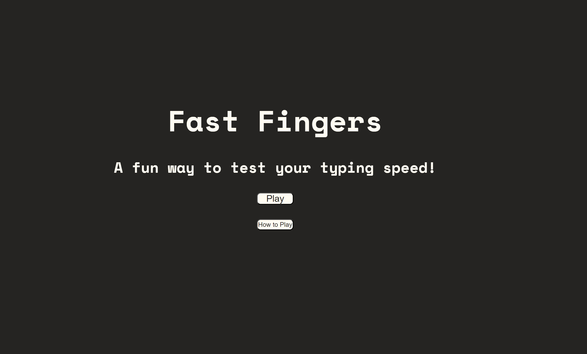
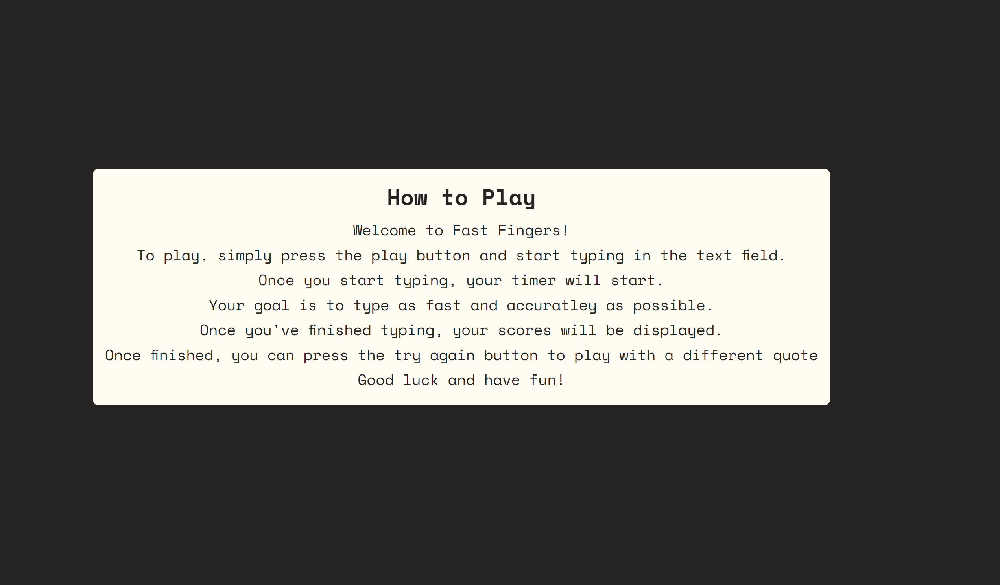

### Typing Test Page

- There is a timer at the top of the screen which starts once the first character is typed, this timer goes on until the quote is correctly typed.
- When the user gets a letter correct, it is coloured in green - when it is incorrect, it is coloured in red.
- There are mistake, CPM, and WPM counters along the bottom of the white area which accuratley counts each score.
- There is a try again button which refreshes the text-area, all counters and brings forward a new quote.

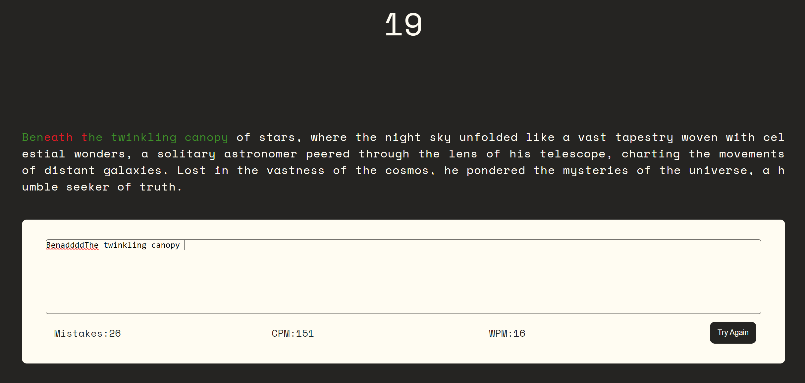

There is also a results modal which appears once the quote is correctly typed out which displays the scores and time for the user.

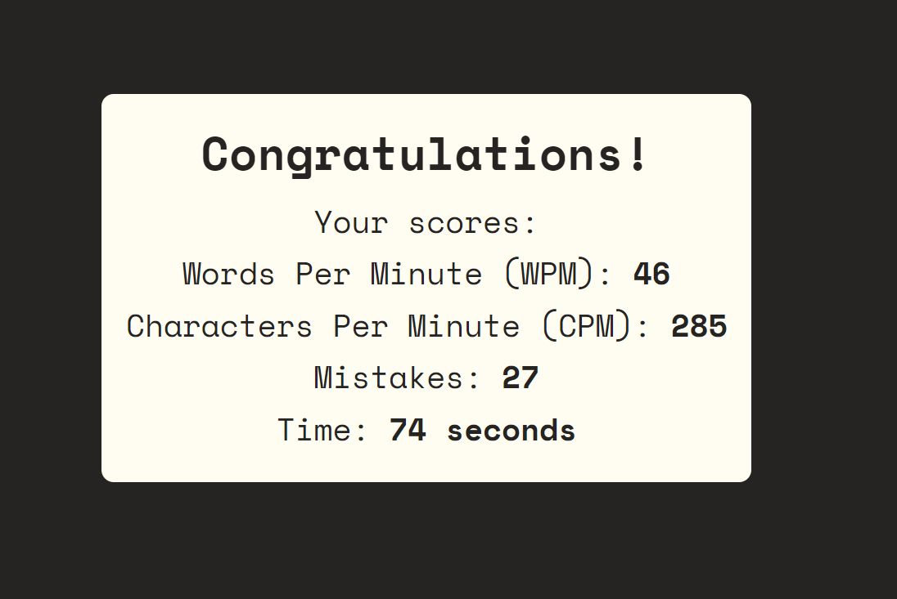

## Future Features

- In the future, I would like to store users scores and have a leaderboard feature which they could look back at and set new high scores.
- In the future, I would add different gamemodes such as easy mode or hard mode.
- In the future, I would add the option to chose the backgrounds when on the typing test page.

## Languages Used

- [HTML5](https://en.wikipedia.org/wiki/HTML5)

- [CSS3](https://en.wikipedia.org/wiki/Cascading_Style_Sheets)

- [JavaScript](https://en.wikipedia.org/wiki/JavaScript)

## Validator Testing

### HTML

No errors were returned when passing through the official W3C validator

- https://validator.w3.org/nu/?doc=https%3A%2F%2Fbrad-hammond.github.io%2FFast-Fingers%2F

### CSS

No errors were found when passing through the official Jigsaw validator

- http://jigsaw.w3.org/css-validator/validator?lang=en&profile=css3svg&uri=https%3A%2F%2Fbrad-hammond.github.io%2FFast-Fingers%2F&usermedium=all&vextwarning=&warning=1

### Javascript

No errors were found when passing through the official Jshint validator - this is for both JS files

- Please see below screen shot of the results:

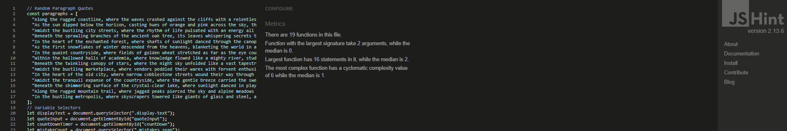

### User Stories Testing

#### First Time User

| Story No. | Result    | Story/ Evidence                                                                                                                                                                                                                                                                                                                                                                                                                                                                        |
| --------- | --------- | -------------------------------------------------------------------------------------------------------------------------------------------------------------------------------------------------------------------------------------------------------------------------------------------------------------------------------------------------------------------------------------------------------------------------------------------------------------------------------------- |
| 1         | Test Pass | As a first time user , <br> I want to be able to know how to play the game <br> so that I can enjoy the game. <br><br>I know I am done when there are clear instructions shown to the user. <br><br>Evidence:<br>The index page has a clear how to play button which allows the user to press and see the instructions on how to play the game.<br> <br> |
| 2         | Test Pass | As a first time user , <br> I want to be able to see my CPM and WPM <br> so I can see how fast I am typing <br><br>I know i am done when I can see my CPM and WPM scores. <br><br>Evidence:<br>Both the CPM and WPM counters are located just below the text-area. This allows for easy visibility even whilst typing.<br> 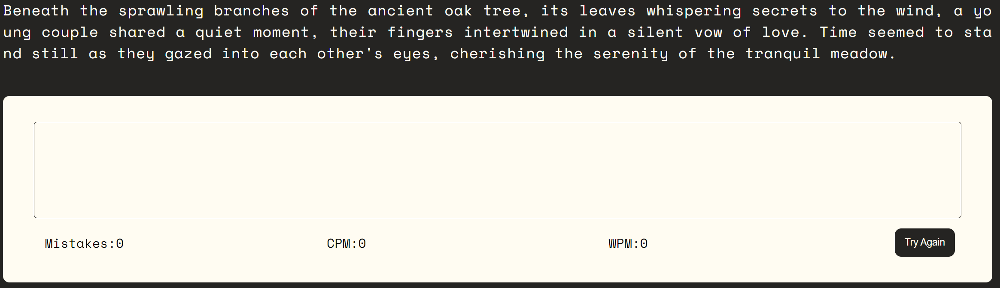                                                                                             |
| 3         | Test Pass | As a first time user , <br> I want to be able to see how long I have been typing for <br> so that I can see if my time is good or bad <br><br>I know I am done when I can see the timer for my session. <br><br>Evidence:<br>The timer is easily visible at the top of the screen, allowing users to view this even whilst typing.<br>                                                                                  |

#### Returning Users

| Story No. | Result    | Story/ Evidence                                                                                                                                                                                                                                                                                                                                                                             |
| --------- | --------- | ------------------------------------------------------------------------------------------------------------------------------------------------------------------------------------------------------------------------------------------------------------------------------------------------------------------------------------------------------------------------------------------- |
| 1         | Test Pass | As a returning user, <br> I want to refine my typing skills <br> so that I can improve my scores. <br><br>I know I am done when my typing speed has increased. <br><br>Evidence:<br>When the user has improved, their results at the end will be better than their last times!.<br>                                              |
| 2         | Test Pass | As a returning user , <br> I want to have new and different sentences to type <br> so that I can keep being challenged.<br><br>I know I am done when their are new sentences and paragraphs for me to type. <br><br>Evidence:<br>Once the users clicks the try again button, a new sentence will be generated for them.<br>  |

#### All Users

| Story No. | Result    | Story/ Evidence                                                                                                                                                                                                                                                                                                                                                                                                                 |
| --------- | --------- | ------------------------------------------------------------------------------------------------------------------------------------------------------------------------------------------------------------------------------------------------------------------------------------------------------------------------------------------------------------------------------------------------------------------------------- |
| 1         | Test Pass | As a user , <br> I want to be able to try again if I made a mistake<br> so that I can restart and try to improve. <br><br>I know I am done when I have restarted the game. <br><br>Evidence:<br>The user can press the try again button to restart the game.<br>                                                                                                   |
| 2         | Test Pass | As a user , <br> I want to be able to view my scores after completing the quote<br> so that I can see if I have improved. <br><br>I know I am done when the scores are shown after completion. <br><br>Evidence:<br>Once the user has completed typing out the quote successfully, the results modal will appear with their scores.<br>                            |
| 3         | Test Pass | As a user , <br> I want to be able to see if I have made any mistakes while typing<br> so that I can go back and correct if need be.<br><br>I know I am done when I can see if the quotes letters are red or green. <br><br>Evidence:<br>If a mistake is made whilst typing, the user can see this as the characters mistyped will appear red in the quote.<br>  |

## Testing

### Accessibility Testing

To test the accessibility, I used lighthouse - please see below my scores:

#### Desktop

- Homepage:

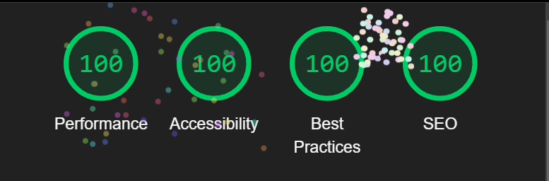

- Typing-Test Page:

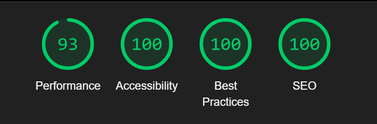

#### Mobile

- Homepage:


- Typing-Test Page:

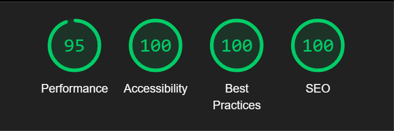

### Manual Testing

- I have tested that this website works in different web browsers.
- I have tested that this website works on different devices such as mobile, tablet and laptop.
- I have tested that the user can interact fully with the website and all links and code works as intended.
- I have tested that all text and fonts are readable and easy to understand.
- I have tested that the results modal appears only once the text is typed correctly and that it has the correct scores shown.
- I have tested that the how to play modal appears with the instructiosn only once the how to play button is pressed.
- I have tested that all text and fonts are readable and easy to understand.

### Different Devices

#### Desktop

| Safari 17.4                                                                       | Firefox 125.0.1                                                                     | Chrome 124.0.6367.60                                                         |
| --------------------------------------------------------------------------------- | ----------------------------------------------------------------------------------- | ---------------------------------------------------------------------------- |
| 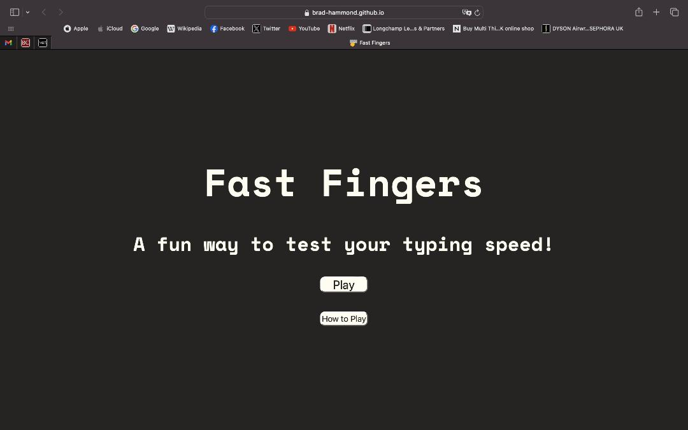        | 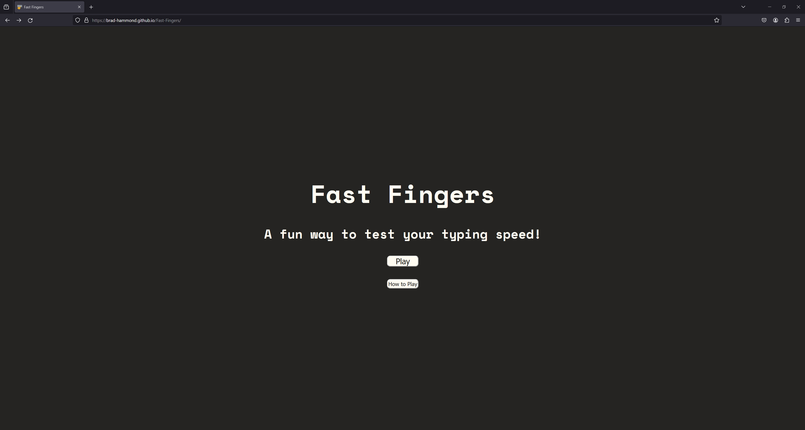        | 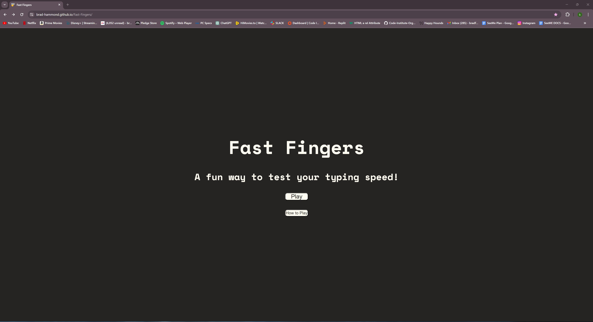   |
| 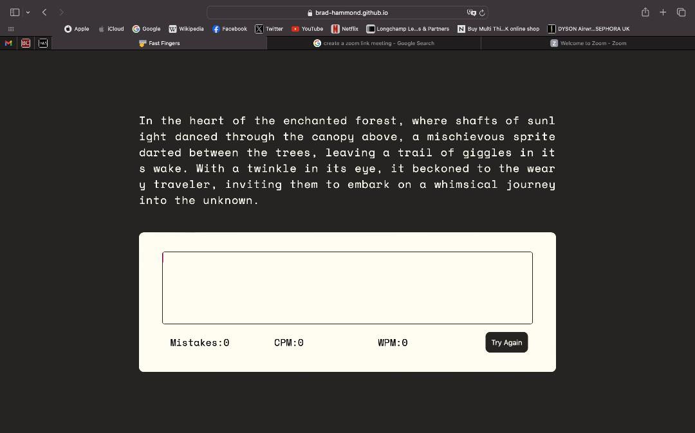 | 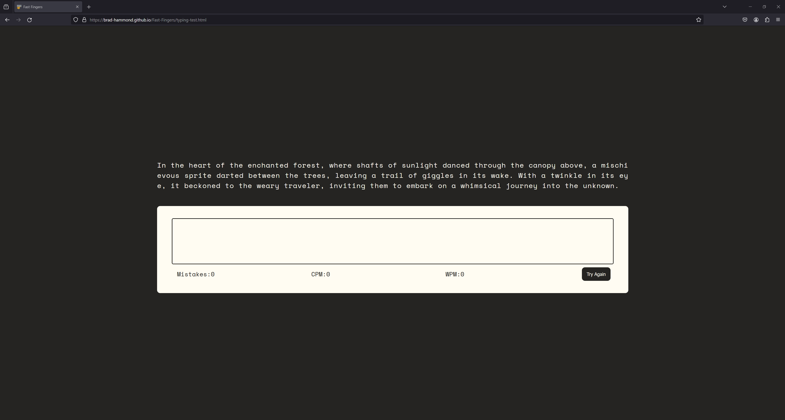 | 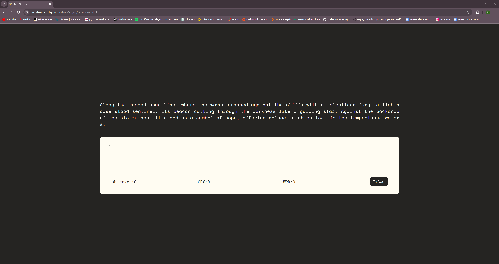 |

#### Mobile

| IOS 17 - Iphone                                                           | IOS 17 - Tablet                                                           | Android 14.0                                                                |
| ------------------------------------------------------------------------- | ------------------------------------------------------------------------- | --------------------------------------------------------------------------- |
| 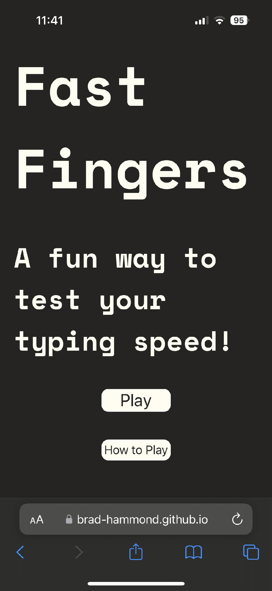        | 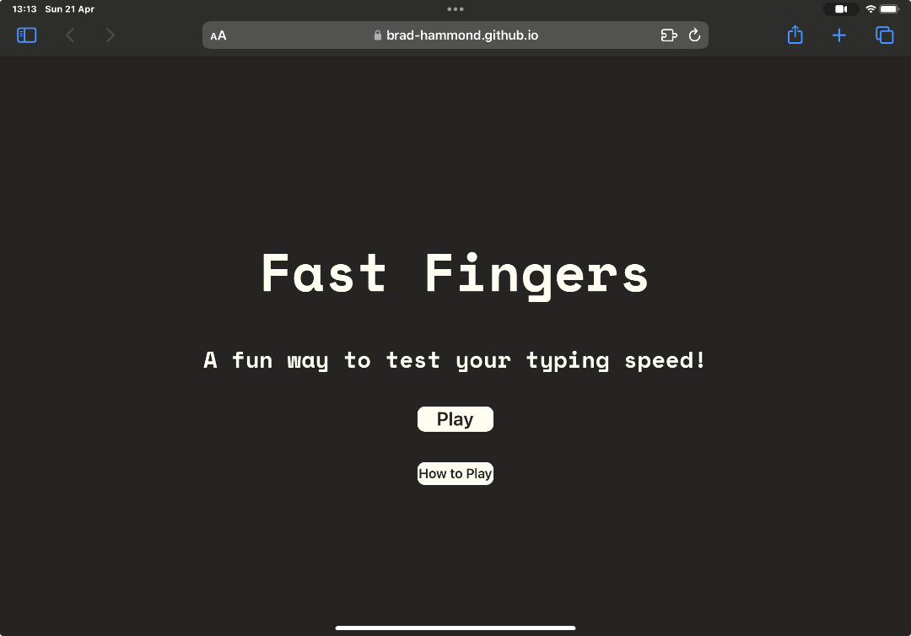        | 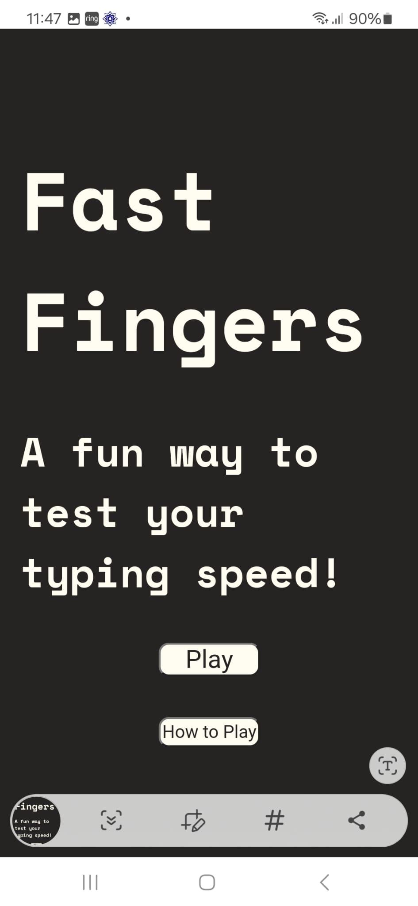        |
| 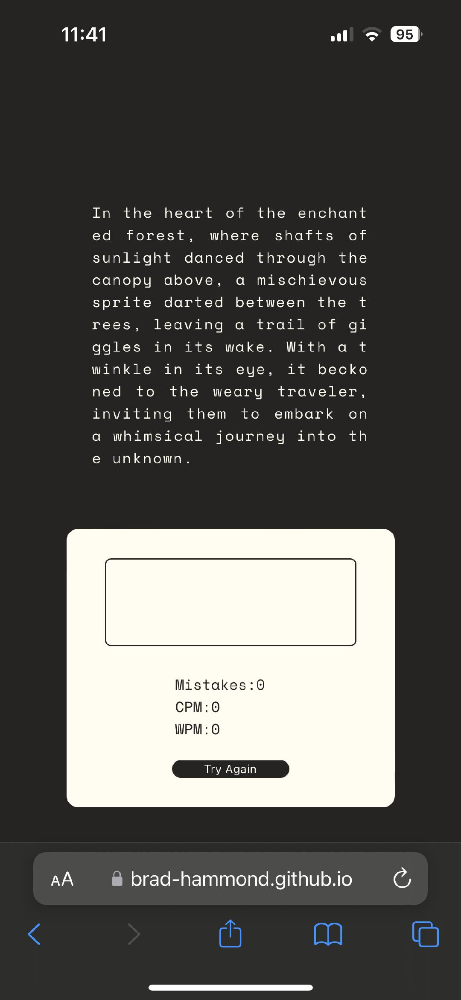 | 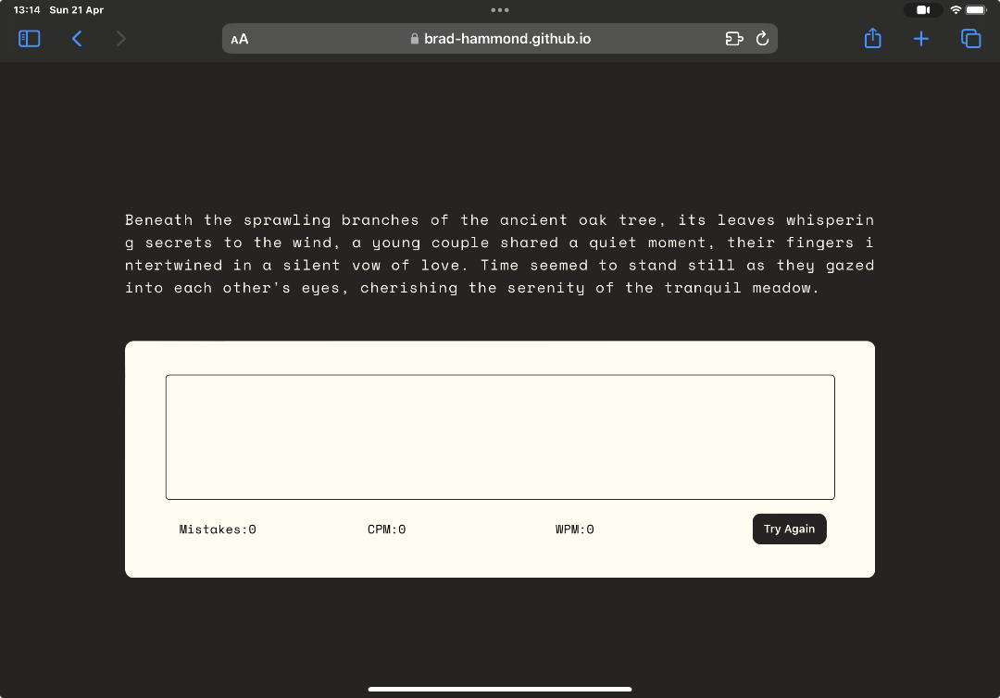 |  |

### Bugs

#### Mistake Counter Bug

Back spaces were being included in the mistake counter, this was causing the counter to be inaccurate.<br>
The below code was used to fix this issue:

```JS
if (event.inputType !== "deleteContentBackward" && !correct) {
    mistakeCounter++;
    mistakeCount.textContent = mistakeCounter;
  }
```

#### Results Modal Bug

The CPM and WPM counters were not showing the correct scores on the result modal.<br>
To fix this, I used console.log to check if the values were pulling correctly in the console.<br>
Once confirmed that it was, I found that it was a calculateCPM function was being called twice, removing this fixed the issue.

#### Countdown Timer Bug

On smaller screens, the count down timer was appearing over the quote text.<br>
To fix this, I added media quries for smaller screens and amended the sizing of the quote text and timer.<br>
Please see below snippet of the code applied:

```CSS
@media screen and (min-width: 280px) and (max-width: 374px) {
.display-text {
    font-size: 12px;
    width: 250px;
  }
  .count-down {
    font-size: 2rem;
  }
}
```

### Known Bugs

#### Display Text

The display text that the user has to type overflows onto the next line mid word - I am unable to fix this.

- Please see below snippet of this:

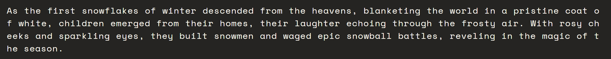

### Cloning & Forking

#### Fork

1. On GitHub.com, navigate to the [Brad-Hammond/Fast-Fingers](https://github.com/Brad-Hammond/Fast-Fingers) repository.
2. In the top-right corner of the page, click Fork.
3. By default, forks are named the same as their parent repositories. You can change the name of the fork to distinguish it further.
4. Add a description to your fork.
5. Click Create fork.

#### Clone

1. Above the list of files click the button that says 'Code'.
2. Copy the URL for the repository.
3. Open Terminal. Change the directory to the location where you want the cloned directory.
4. Type git clone, and then paste the URL
5. Press Enter.

### Local Deployment

1. Sign up to [Gitpod](https://gitpod.io/)
2. Download the Gitpod browser extension.
3. On GitHub.com, navigate to the [Brad-Hammond/Fast-Fingers](https://github.com/Brad-Hammond/Fast-Fingers) repository.
4. Above the list of files click the button that says 'Gitpod'.

### Remote Deployment

The site was deployed to Github pages. If you have forked/cloned the repository the steps to deploy are:

1.  On GitHub.com, navigate to your repository.
2.  Navigate to the settings tab.
3.  Click on the tab called 'pages' on the left hand side.
4.  From the source drop down list under the heading Build and deployment, select main.
5.  The page will hten provide the link to the website.

## Credits

- For inspiration and ideas, credits to [Coding with David](https://www.youtube.com/watch?v=E_tZH9R_zi8&list=LL&index=2&t=5065s&ab_channel=CodingWithDawid)
- For the fonts used, credits to [Google Fonts](https://fonts.google.com/)
- HTML, CSS and Javascript code help was taken from w3schools - [W3Schools](https://www.w3schools.com/)
- Credits to [Device Frames](https://deviceframes.com/)
- Credits to [Code Institute](https://codeinstitute.net/full-stack-software-development-diploma/?utm_term=code%20institute&utm_campaign=CI%2B-%2BUK%2B-%2BSearch%2B-%2BBrand&utm_source=adwords&utm_medium=ppc&hsa_acc=8983321581&hsa_cam=1578649861&hsa_grp=62188641240&hsa_ad=635720257674&hsa_src=g&hsa_tgt=kwd-319867646331&hsa_kw=code%20institute&hsa_mt=e&hsa_net=adwords&hsa_ver=3&gad_source=1&gclid=Cj0KCQjw8pKxBhD_ARIsAPrG45kfZu0iDMkC26LnD1BA9bVqqhFchKG1Ib_SZOD-r7-C87RpU2b6i1EaAsbWEALw_wcB&nab=2&utm_referrer=https%3A%2F%2Fwww.google.com%2F) for the learning matertial
-
